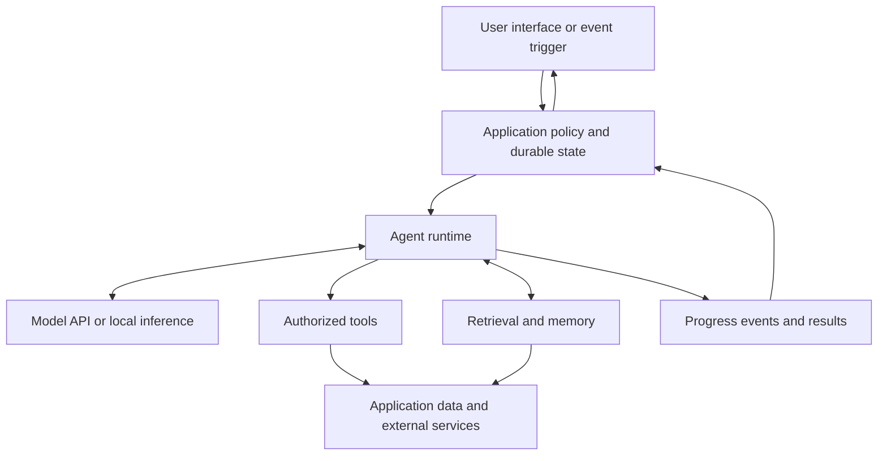

# A map of an agentic system

[Handbook](../../README.md) · [Orientation](README.md)

An agentic application coordinates a model, executable capabilities, context, and decisions about when to continue or stop. A chat window is one possible interface. A command-line coding assistant, scheduled researcher, or background document processor can use the same basic structure.

This diagram is a conceptual architecture, not a requirement to create separate services:

## Follow one task

Suppose a user asks, “Which release tasks are blocked, and draft a short update?” The application authenticates the user and establishes the workspace. The runtime gives the model instructions, the relevant conversation, and available tools. The model can request a task query. Application code or a configured remote tool executes that query with the user's permissions. The model receives the result and drafts a response with references.

If the user then says, “Post it,” publishing is a separate action. The system needs a target, current authorization, an execution result, and a way to avoid duplicating the post after a retry. A well-written answer alone does not prove that the action happened.

## Identify the responsibility

| Responsibility | What it owns | What to learn |
| --- | --- | --- |
| Model | Producing text, structured output, or proposed tool calls from input | [Foundations](../01-foundations/README.md), [model selection](../02-models-and-providers/README.md) |
| Calling layer | Provider requests, response parsing, streaming, and continuation | [Calling models](../03-calling-models/README.md) |
| Runtime or harness | Repeating the loop, choosing execution policy, managing run state | [Orchestration](../05-orchestration/README.md) |
| Tool integration | A capability's schema, execution, access checks, and result | [Tools and protocols](../04-tools-and-protocols/README.md) |
| Knowledge layer | Retrieving relevant source material and tracking freshness | [Knowledge and memory](../06-knowledge-and-memory/README.md) |
| Interface | Showing messages, actions, sources, status, errors, and controls | [Rendering](../07-interfaces-and-rendering/README.md) |
| Deployment | Where inference, runtime, tools, and storage run | [Hosting](../08-hosting-and-delivery/README.md) |
| Operations | Evidence of correctness, behavior, latency, and cost | [Evaluation and operations](../09-evaluation-and-operations/README.md) |

These are boundaries of responsibility, not necessarily process boundaries. One conventional application can own authentication, the agent loop, tools, storage, and the HTTP interface while calling a remote model. More services become useful when a measured need justifies them.

## Two views of the same field

When using a coding agent, your repository becomes its working environment; skills and instructions guide the work; shell, editor, and MCP tools provide capabilities. When building an agent into a product, your application must provide those responsibilities to its users. Learn the [development workflow](../10-development-workflows/README.md) and the [runtime](../05-orchestration/README.md) separately so client conveniences are not mistaken for features of a model API.

The precise protocol definitions are covered in their chapters. The diagrams here intentionally describe application concepts without implying a universal wire format.
