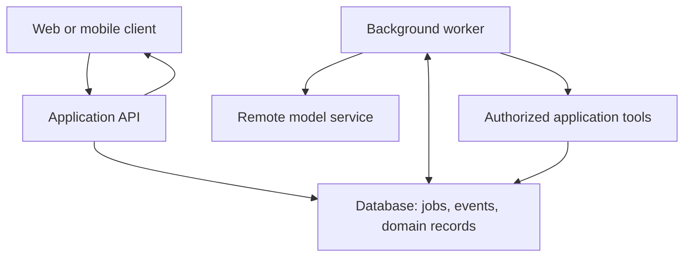

# Deploying an agentic application

[Handbook](../../README.md) · [Hosting](README.md)

Source-reviewed: 2026-09-19 for named serving tools. The architecture below is an illustrative application design, not a deployment tested against a hosting provider.

Begin by assigning an owner to inference, the agent loop, tools, persistence, and delivery of results. They can run in one application or several services. Split them when isolation, independent scaling, or a concrete runtime requirement makes the separation useful.

## A conventional starting point

A small product can run an HTTP application, a background worker, and a database on familiar infrastructure. The worker calls a hosted model and invokes application services. Add a queue or use a database-backed job mechanism when work must survive HTTP disconnects. Store files in durable storage if users need them later.

The client receives a run ID promptly and subscribes to progress or polls the run. The worker stores results so a browser reload does not lose them. This design works conceptually with PHP, TypeScript, Python, Go, or another server language; the model API does not require the rest of the application to use its SDK's language.

## Choose the execution shape

| Workload | Useful starting point | Boundary to verify |
| --- | --- | --- |
| Short transformation of supplied text | Direct request in an application endpoint | Request timeout and bounded output |
| Several application tool calls | A bounded loop in a worker or a managed runtime | Retry policy, identity, and terminal states |
| Long research with human input | Durable run/session plus progress events | Resumption, cancellation, input correlation |
| Untrusted code or shell execution | Separate restricted sandbox | Filesystem, network, credentials, and resource limits |
| Private model serving | Inference server separate from application worker | Hardware, model support, throughput, and access controls |

Serverless functions are one possible execution location. Check their duration, streaming, background execution, and lifecycle contract rather than assuming that launching a promise after returning HTTP will keep work alive.

## Local and self-hosted inference

[Ollama](https://docs.ollama.com/api/introduction) provides local model serving as well as cloud access. Selecting a cloud model through a local client still sends inference work remotely. Record the actual model and execution destination.

[vLLM online serving](https://docs.vllm.ai/en/latest/serving/online_serving/) provides serving infrastructure for supported models. It is the inference part of the system; application authorization, job persistence, and the user interface remain separate. Validate the model's chat template, tool parser, structured output support, memory requirements, and concurrent-request behavior before treating API-shape compatibility as complete application compatibility.

A local model can reduce a network dependency, but its effective cost includes hardware, utilization, maintenance, and queueing under load. Test with realistic input sizes and concurrency. A model that fits in memory may still be too slow for the intended interaction.

## Deploy the failure path too

Bound work by time, model turns, tool calls, and cost. Persist checkpoints at recoverable boundaries. Store action receipts for writes. Propagate cancellation where supported and stop scheduling new actions. Drain workers during deployments or let a lease expire safely. Preserve useful results independently of transient process or sandbox files.

Measure before introducing more services. The next chapters explain [tracing](../09-evaluation-and-operations/tracing.md), [evaluation](../09-evaluation-and-operations/evaluations.md), and [security boundaries](../09-evaluation-and-operations/security.md).
