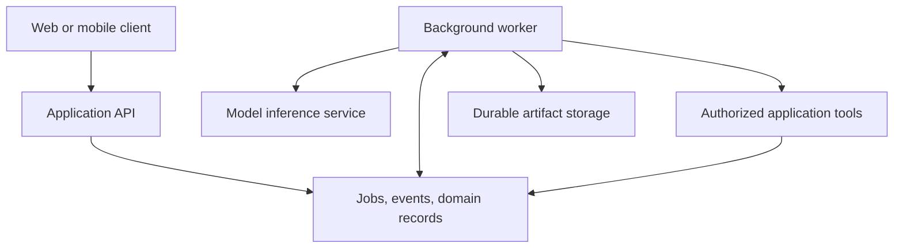

# Deployment architecture for agentic applications

Begin by assigning ownership of inference, orchestration, tools, persistence, and result delivery. Split services when isolation, independent scaling, or a concrete runtime requirement warrants it.

A small product can start with an application API, a worker, and a database on familiar infrastructure. The worker calls a hosted model and invokes authorized application services. A database-backed job mechanism or queue allows work to survive an HTTP disconnect.

Return a run ID promptly. Persist progress and final results so a reload can reconstruct the interaction. Keep the business transaction boundary in application services, including when tools arrive from a remote harness.

Use separate compute for untrusted code and private inference serving. For serverless workers, verify execution duration, streaming, and background-lifecycle behavior; returning a response does not guarantee that an unfinished promise keeps running.

Deploy the failure path too: enforce time and call budgets, checkpoint recoverable progress, reconcile unknown writes, propagate cancellation, and drain workers or safely expire their leases during rollout. Measure queue time, model latency, tool latency, and delivery independently before introducing additional services. [Temporal's execution model](https://docs.temporal.io/workflow-execution) provides one reference for recovery across worker failures.
