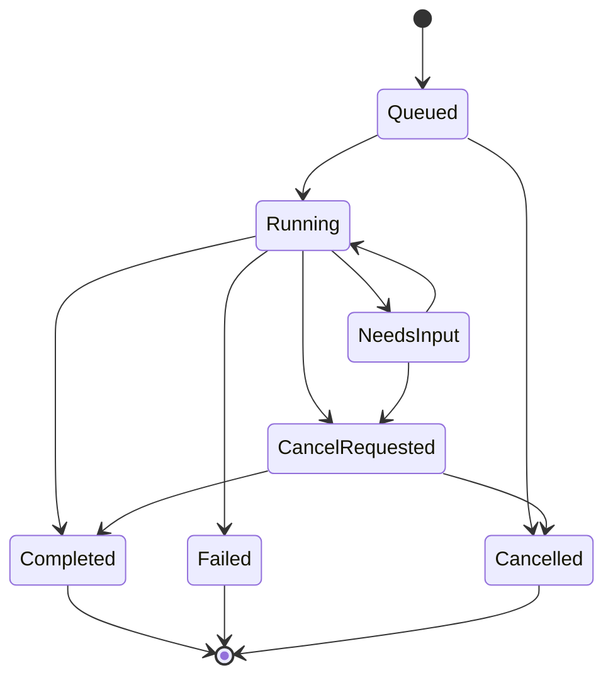

# Recipe: background work with a durable result

**Goal:** let a user request a research report, continue using the application, and return to the result later. This is an illustrative application contract, independent of any provider API.

## Persist before acknowledging work

The server authenticates the request, creates a run tied to the workspace and conversation, and records enough input to resume it. A durable job mechanism schedules execution. Return the run ID once scheduling is durably established; a database transaction or outbox avoids recording a job that never reaches the worker.

An illustrative response from your own application:

```http
HTTP/1.1 202 Accepted
Content-Type: application/json
Location: /api/runs/run_123

{"run_id":"run_123","status":"queued"}
```

The worker can own the loop or submit work to a [managed agent runtime](../docs/08-hosting-and-delivery/managed-agents.md). In both designs, correlate the application run with the provider's request/session identifiers.

## Model states explicitly



A cancellation request can race with completion. Do not present an already committed action as reversed simply because the user pressed Stop. Record the resulting state and any completed actions accurately.

## Keep events separate from presentation

Store monotonically ordered application events with run IDs and unique event IDs. The client can reconnect from its last received event. A stream is one delivery mechanism; persistence makes the events recoverable.

```json
{
  "event_id": "evt_19",
  "run_id": "run_123",
  "sequence": 19,
  "type": "artifact_ready",
  "artifact_id": "report_8"
}
```

This event shape is illustrative and not an AG-UI or provider schema. Translate your chosen protocol at the boundary. Store the full report as a durable artifact and post a reference in the conversation. The UI or voice session can summarize it without becoming its only storage location.

## Recover safely

Give workers a lease or another mechanism for claiming work. A retry must check persisted progress and action receipts before repeating side effects. Bound attempts and end in an explicit failure state when recovery is exhausted. Tie approvals and later user input to the exact pending action so a stale browser tab cannot approve a changed operation.

Use [execution-state guidance](../agent-systems/orchestration/execution/agent-loops.md), [tracing](../operations/tracing.md), and [interface lifecycle guidance](../docs/07-interfaces-and-rendering/chat-rendering.md) to implement and inspect the boundaries.
